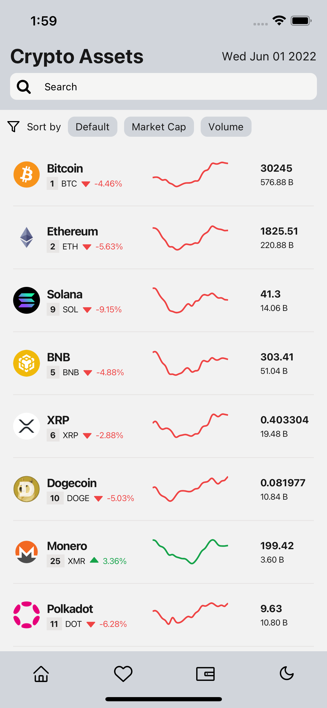
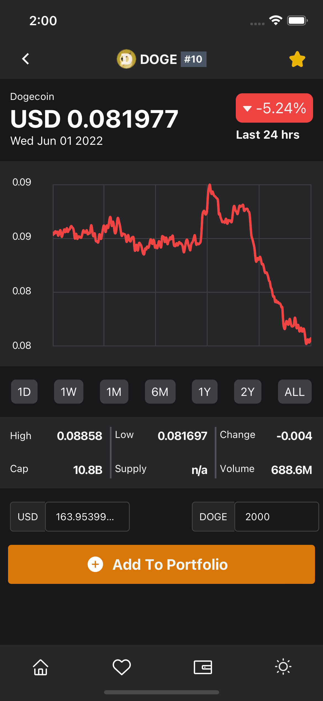
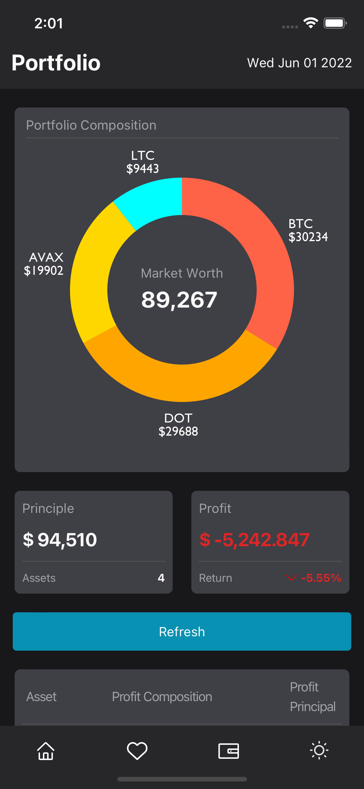
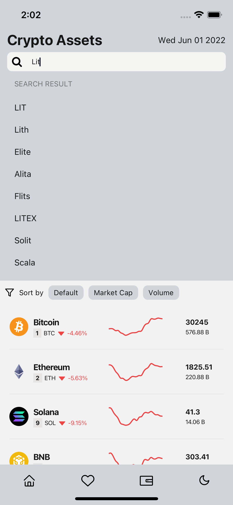

# Cryptocurrency Tracker

## IOS/Android App (Frontend)

<p float="left">
    
    
    
</p>

- Built with typescript, react-native, expo, native-base, reanimated
- Fully animated app (page transition, add/delete animation, swipe to delete, graph transition animation, etc)
- Support dark & light mode
- Async storage to save app data
- Crypto search engine

## App Demo






## Project Structure

```
$PROJECT_ROOT
│   # Screen files
├── screens
│   # React-native component files
├── components
│   # Data fetching
├── services
│   # compiled tailwindcss style sheet
├── redux
│   # redux reduces, slicers and action creators
├── assets
│   # image and mock data files
└── public
```

## Materials

- React-Native Vector Icons
- Data (CoinGecko)
